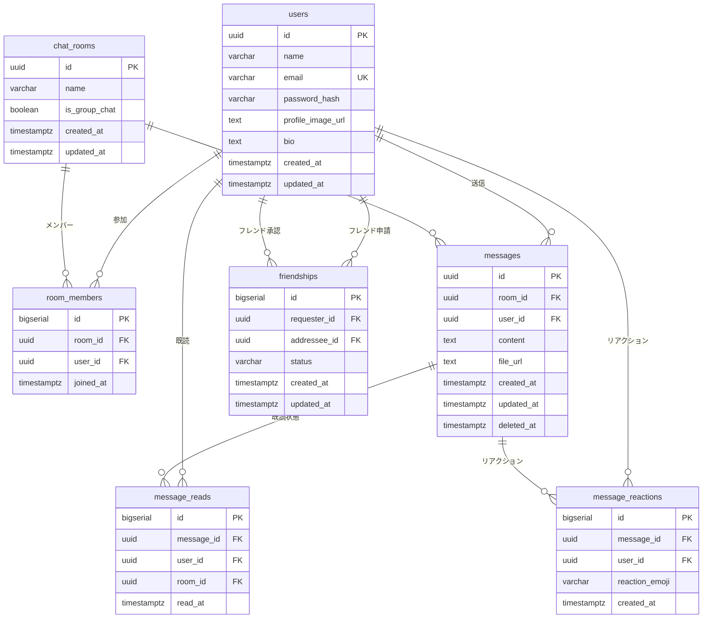

# チャットアプリ デザイン設計書

## 1. システム全体設計

### 1.1 アーキテクチャ概要

```
┌─────────────────┐    ┌─────────────────┐    ┌─────────────────┐
│   Frontend      │    │   Backend       │    │   Database      │
│   (Next.js)     │◄──►│   (Go + Echo)   │◄──►│  (PostgreSQL)   │
│                 │    │                 │    │                 │
│ - React UI      │    │ - REST API      │    │ - User Data     │
│ - WebSocket     │    │ - WebSocket     │    │ - Messages      │
│ - State Mgmt    │    │ - Auth (JWT)    │    │ - Chat Rooms    │
└─────────────────┘    └─────────────────┘    └─────────────────┘
                                │
                                ▼
                       ┌─────────────────┐
                       │  File Storage   │
                       │ (AWS S3/R2)     │
                       │                 │
                       │ - Images        │
                       │ - Files         │
                       └─────────────────┘
```

### 1.2 モノレポ構造

```
cc-chat-app/
├── apps/
│   ├── frontend/          # Next.js アプリケーション
│   └── backend/           # Go API サーバー
├── packages/
│   ├── types/             # 共通型定義
│   ├── ui/                # 共通UIコンポーネント
│   └── config/            # 共通設定
├── docs/                  # ドキュメント
├── docker-compose.yml     # 開発環境
└── turbo.json            # Turborepo設定
```

## 2. データベース設計

### 2.1 ER図



### 2.2 インデックス設計

```sql
-- パフォーマンス最適化のためのインデックス
CREATE INDEX idx_messages_room_id_created_at ON messages(room_id, created_at DESC);
CREATE INDEX idx_room_members_user_id ON room_members(user_id);
CREATE INDEX idx_message_reads_user_room ON message_reads(user_id, room_id);
CREATE INDEX idx_friendships_users ON friendships(requester_id, addressee_id);
CREATE INDEX idx_users_email ON users(email);
```

## 3. API設計

### 3.1 REST API エンドポイント

#### 認証関連
```
POST   /api/auth/register     # ユーザー登録
POST   /api/auth/login        # ログイン
POST   /api/auth/logout       # ログアウト
POST   /api/auth/refresh      # トークンリフレッシュ
```

#### ユーザー関連
```
GET    /api/users/me          # 自分の情報取得
PUT    /api/users/me          # プロフィール更新
GET    /api/users/search      # ユーザー検索
POST   /api/users/avatar      # アバター画像アップロード
```

#### チャットルーム関連
```
GET    /api/rooms             # 参加中のルーム一覧
POST   /api/rooms             # ルーム作成
GET    /api/rooms/:id         # ルーム詳細
PUT    /api/rooms/:id         # ルーム更新
DELETE /api/rooms/:id         # ルーム削除
POST   /api/rooms/:id/join    # ルーム参加
POST   /api/rooms/:id/leave   # ルーム退出
```

#### メッセージ関連
```
GET    /api/rooms/:id/messages    # メッセージ履歴取得
POST   /api/rooms/:id/messages    # メッセージ送信
PUT    /api/messages/:id          # メッセージ編集
DELETE /api/messages/:id          # メッセージ削除
POST   /api/messages/:id/read     # 既読マーク
POST   /api/messages/:id/reaction # リアクション追加
```

#### フレンド関連
```
GET    /api/friends           # フレンド一覧
POST   /api/friends/request   # フレンド申請
PUT    /api/friends/:id       # 申請承認/拒否
DELETE /api/friends/:id       # フレンド削除
```

### 3.2 WebSocket API

#### 接続・認証
```
WS /ws?token=<jwt_token>
```

#### イベント種別
```javascript
// クライアント → サーバー
{
  "type": "join_room",
  "room_id": "uuid"
}

{
  "type": "send_message",
  "room_id": "uuid",
  "content": "メッセージ内容"
}

{
  "type": "typing_start",
  "room_id": "uuid"
}

{
  "type": "typing_stop",
  "room_id": "uuid"
}

// サーバー → クライアント
{
  "type": "new_message",
  "room_id": "uuid",
  "message": { /* メッセージオブジェクト */ }
}

{
  "type": "user_typing",
  "room_id": "uuid",
  "user_id": "uuid",
  "user_name": "ユーザー名"
}

{
  "type": "message_read",
  "room_id": "uuid",
  "message_id": "uuid",
  "user_id": "uuid"
}
```

## 4. フロントエンド設計

### 4.1 ページ構成

```
/                          # ランディングページ
/auth/login               # ログインページ
/auth/register            # 登録ページ
/chat                     # チャットメイン画面
/chat/rooms/:id           # 個別チャットルーム
/profile                  # プロフィール設定
/friends                  # フレンド管理
/settings                 # 設定画面
```

### 4.2 コンポーネント設計

#### レイアウトコンポーネント
```typescript
// Layout Components
- AppLayout              # アプリ全体のレイアウト
- ChatLayout             # チャット画面のレイアウト
- AuthLayout             # 認証画面のレイアウト

// Navigation Components
- Sidebar                # サイドバー
- Header                 # ヘッダー
- TabNavigation          # タブナビゲーション
```

#### UIコンポーネント
```typescript
// Basic UI Components
- Button                 # ボタン
- Input                  # 入力フィールド
- Modal                  # モーダル
- Avatar                 # アバター画像
- Badge                  # バッジ
- Spinner               # ローディング

// Chat Specific Components
- MessageList           # メッセージ一覧
- MessageItem           # 個別メッセージ
- MessageInput          # メッセージ入力
- RoomList              # ルーム一覧
- RoomItem              # 個別ルーム
- TypingIndicator       # 入力中表示
- EmojiPicker           # 絵文字選択
```

### 4.3 状態管理設計

#### Zustand Store構成
```typescript
// stores/authStore.ts
interface AuthState {
  user: User | null;
  token: string | null;
  isAuthenticated: boolean;
  login: (email: string, password: string) => Promise<void>;
  logout: () => void;
  updateProfile: (data: Partial<User>) => Promise<void>;
}

// stores/chatStore.ts
interface ChatState {
  rooms: Room[];
  currentRoom: Room | null;
  messages: Record<string, Message[]>;
  onlineUsers: string[];
  typingUsers: Record<string, string[]>;
  
  // Actions
  setCurrentRoom: (room: Room) => void;
  addMessage: (roomId: string, message: Message) => void;
  updateMessage: (messageId: string, updates: Partial<Message>) => void;
  setTyping: (roomId: string, userId: string, isTyping: boolean) => void;
}

// stores/friendStore.ts
interface FriendState {
  friends: Friend[];
  friendRequests: FriendRequest[];
  searchResults: User[];
  
  // Actions
  sendFriendRequest: (userId: string) => Promise<void>;
  acceptFriendRequest: (requestId: string) => Promise<void>;
  searchUsers: (query: string) => Promise<void>;
}
```

## 5. バックエンド設計

### 5.1 レイヤードアーキテクチャ

```
┌─────────────────┐
│   Handler       │  # HTTPリクエスト処理
│   (Controller)  │
└─────────────────┘
         │
┌─────────────────┐
│   UseCase       │  # ビジネスロジック
│   (Service)     │
└─────────────────┘
         │
┌─────────────────┐
│   Repository    │  # データアクセス
│   (Infra)       │
└─────────────────┘
```

### 5.2 ディレクトリ構成

```
backend/
├── cmd/
│   └── server/
│       └── main.go           # エントリーポイント
├── internal/
│   ├── handler/              # HTTPハンドラー
│   │   ├── auth.go
│   │   ├── user.go
│   │   ├── room.go
│   │   ├── message.go
│   │   └── websocket.go
│   ├── usecase/              # ビジネスロジック
│   │   ├── auth.go
│   │   ├── user.go
│   │   ├── room.go
│   │   └── message.go
│   ├── repository/           # データアクセス
│   │   ├── user.go
│   │   ├── room.go
│   │   └── message.go
│   ├── model/                # ドメインモデル
│   │   ├── user.go
│   │   ├── room.go
│   │   └── message.go
│   ├── middleware/           # ミドルウェア
│   │   ├── auth.go
│   │   ├── cors.go
│   │   └── logger.go
│   └── config/               # 設定
│       └── config.go
├── pkg/                      # 共通パッケージ
│   ├── jwt/
│   ├── hash/
│   └── validator/
├── migrations/               # DBマイグレーション
├── ent/                      # Entスキーマ定義
└── docker/
    └── Dockerfile
```

### 5.3 WebSocket接続管理

```go
// WebSocket Hub設計
type Hub struct {
    clients    map[*Client]bool
    rooms      map[string]map[*Client]bool
    broadcast  chan []byte
    register   chan *Client
    unregister chan *Client
}

type Client struct {
    hub    *Hub
    conn   *websocket.Conn
    send   chan []byte
    userID string
    roomID string
}
```

## 6. セキュリティ設計

### 6.1 認証・認可

#### JWT設計
```json
{
  "header": {
    "alg": "HS256",
    "typ": "JWT"
  },
  "payload": {
    "sub": "user_id",
    "email": "user@example.com",
    "exp": 1640995200,
    "iat": 1640908800,
    "iss": "chat-app"
  }
}
```

#### 認可フロー
```
1. ユーザーログイン
2. JWTトークン発行（Access Token + Refresh Token）
3. APIリクエスト時にAccess Tokenを検証
4. WebSocket接続時にトークンを検証
5. トークン期限切れ時にRefresh Tokenで更新
```

### 6.2 セキュリティ対策

#### API保護
- CORS設定
- Rate Limiting
- Input Validation
- SQL Injection対策（Ent ORM使用）
- XSS対策（Content Security Policy）

#### ファイルアップロード
- ファイル形式検証
- ファイルサイズ制限
- ウイルススキャン（将来実装）
- 署名付きURL使用

## 7. パフォーマンス設計

### 7.1 データベース最適化

#### クエリ最適化
- 適切なインデックス設計
- N+1問題の回避
- ページネーション実装
- 接続プール設定

#### キャッシュ戦略
```
- メモリキャッシュ（アプリケーション内）
- Redis（将来実装）
  - セッション情報
  - オンラインユーザー状態
  - 頻繁にアクセスされるデータ
```

### 7.2 フロントエンド最適化

#### パフォーマンス対策
- コード分割（Dynamic Import）
- 画像最適化（Next.js Image）
- 仮想スクロール（メッセージ一覧）
- メモ化（React.memo, useMemo）
- Service Worker（将来実装）

#### バンドル最適化
```javascript
// next.config.js
module.exports = {
  experimental: {
    optimizeCss: true,
  },
  webpack: (config) => {
    config.optimization.splitChunks = {
      chunks: 'all',
      cacheGroups: {
        vendor: {
          test: /[\\/]node_modules[\\/]/,
          name: 'vendors',
          chunks: 'all',
        },
      },
    };
    return config;
  },
};
```

## 8. 監視・ログ設計

### 8.1 ログ設計

#### 構造化ログ
```json
{
  "timestamp": "2024-01-01T12:00:00Z",
  "level": "info",
  "service": "chat-api",
  "user_id": "uuid",
  "request_id": "uuid",
  "message": "User logged in",
  "metadata": {
    "ip": "192.168.1.1",
    "user_agent": "Mozilla/5.0..."
  }
}
```

#### ログレベル
- ERROR: システムエラー、例外
- WARN: 警告、異常な状況
- INFO: 重要な業務イベント
- DEBUG: デバッグ情報（開発環境のみ）

### 8.2 メトリクス設計

#### 監視項目
- システムメトリクス（CPU、メモリ、ディスク）
- アプリケーションメトリクス（レスポンス時間、エラー率）
- ビジネスメトリクス（アクティブユーザー数、メッセージ数）
- WebSocket接続数・切断数

## 9. デプロイ・インフラ設計

### 9.1 CI/CD パイプライン

```yaml
# .github/workflows/deploy.yml
name: Deploy
on:
  push:
    branches: [main]

jobs:
  test:
    runs-on: ubuntu-latest
    steps:
      - uses: actions/checkout@v3
      - name: Run tests
        run: |
          pnpm install
          pnpm test
          
  deploy-frontend:
    needs: test
    runs-on: ubuntu-latest
    steps:
      - name: Deploy to Vercel
        uses: amondnet/vercel-action@v20
        
  deploy-backend:
    needs: test
    runs-on: ubuntu-latest
    steps:
      - name: Deploy to Render
        run: |
          # Render deployment script
```

### 9.2 環境構成

#### 開発環境
- Docker Compose
- ホットリロード
- 開発用データベース

#### 本番環境
- Vercel（フロントエンド）
- Render（バックエンド）
- PostgreSQL（マネージドサービス）
- Cloudflare R2（ファイルストレージ）

## 10. テスト設計

### 10.1 テスト戦略

#### フロントエンド
```typescript
// Unit Tests (Jest + Testing Library)
- コンポーネントテスト
- カスタムフックテスト
- ユーティリティ関数テスト

// Integration Tests
- API通信テスト
- WebSocket通信テスト

// E2E Tests (Playwright)
- ユーザーフローテスト
- クロスブラウザテスト
```

#### バックエンド
```go
// Unit Tests (Go testing + testify)
- ビジネスロジックテスト
- ユーティリティ関数テスト

// Integration Tests (testcontainers)
- データベース操作テスト
- API エンドポイントテスト

// WebSocket Tests
- 接続・切断テスト
- メッセージ送受信テスト
```

### 10.2 テストデータ管理

#### テストデータベース
- Docker Compose でテスト用PostgreSQL起動
- マイグレーション自動実行
- テストデータのシード

#### モック・スタブ
- 外部API呼び出しのモック
- ファイルストレージのモック
- WebSocket接続のモック